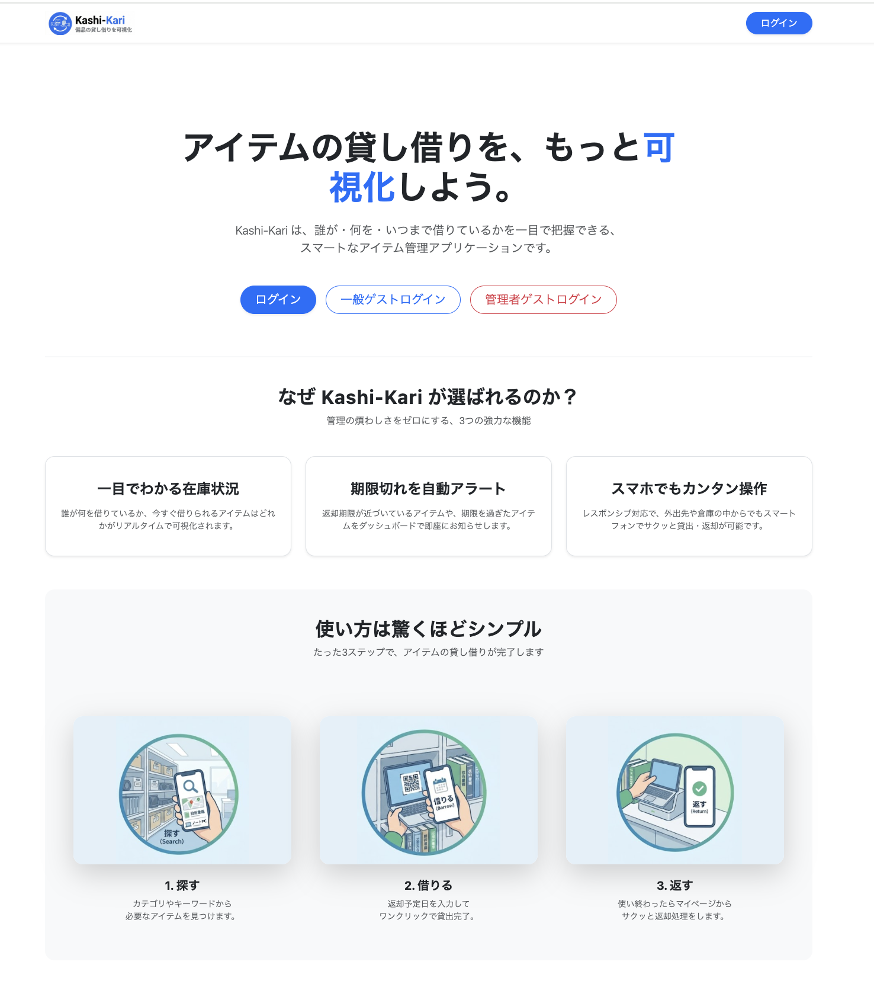
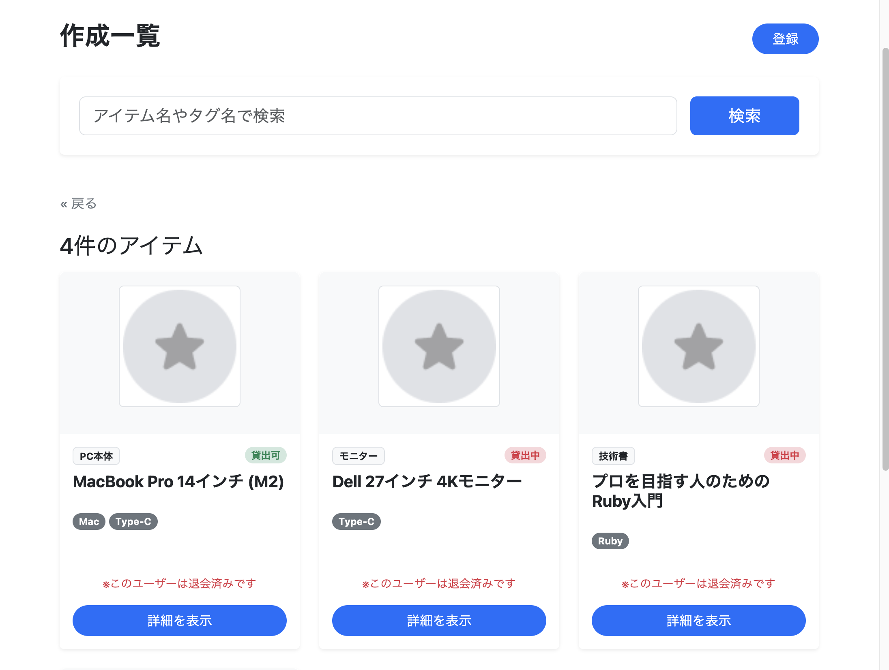
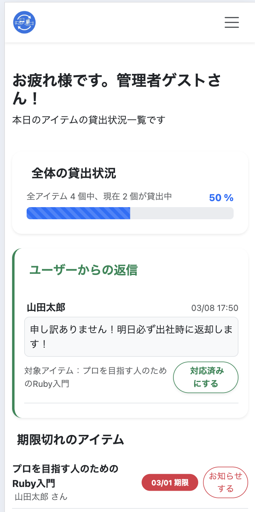
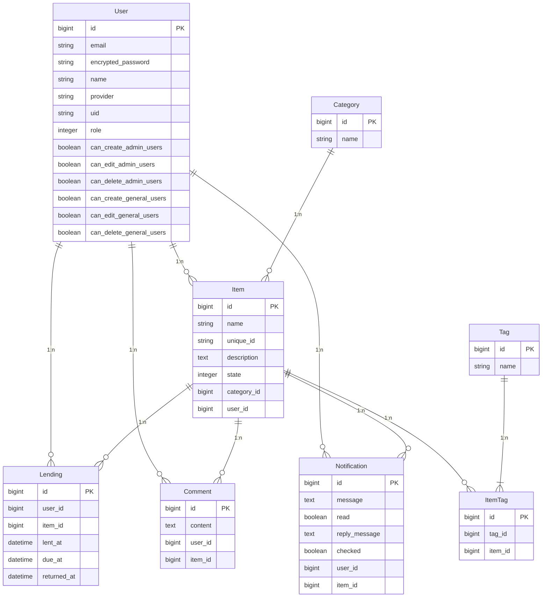

# アイテム管理アプリ: Kashi-Kari

社内や組織内にあるアイテムを「誰が・いつ・何を借りているか」を可視化できる「アイテム管理アプリ」です。

これにより、

* アイテムの貸し借りを一覧を一目で確認。
* 修理中やメンテ中のアイテムの管理。
* 登録したアイテムの紛失を防ぐ。

ことができます。

## アプリURL
https://equipment-management-app-cdd9a767bd1d.herokuapp.com/

### テスト用ログインアカウント
※「採用ご担当者様」、「実際にアプリを確認されたい方」は、以下の情報を入力して実際の動作をご確認ください。

トップ画面

- **管理者アカウント**
  - 管理者ゲストログインをクリック!
  - 管理者用ダッシュボード

- **一般ユーザーアカウント**
  - 一般ユーザーログインをクリック!
  - 一般ユーザー用ダッシュボード

## 動作イメージ（一部抜粋）
#### アイテム一覧 png

#### ダッシュボード一覧 

#### 貸出・返却時の動作 gif

貸出時

<video src="https://github.com/tushiko23/equipment-management-app/blob/develop/app/assets/videos/lending_demo.mp4" width="640" height="360" controls>
  ブラウザが動画タグをサポートしていません。
</video>

返却時

<video src="https://github.com/tushiko23/equipment-management-app/blob/develop/app/assets/videos/returning_demo.mp4" width="640" height="360" controls>
  ブラウザが動画タグをサポートしていません。
</video>
---

## 1. 制作背景・目的
就労支援移行事業所で、いつも貸し出しPCや充電器が行方不明となっていて、毎回探す手間がかかっている状況でした。

「誰がどのアイテムを貸し借りしているのかを可視化」すれば、「探す手間や管理する手間を減らすことができる」と考え、Web上でリアルタイムに管理するアプリを開発しました。

## 2. 主要機能
### 全ユーザー共通
- アイテムの閲覧・検索 （アイテム・カテゴリ・タグ名で絞り込み可能）
- アイテムの貸出・返却機能
- 自身が借りているアイテムの確認
- 貸し借り通知の受け取り・返信
- アイテムへのコメント機能
- ユーザー・プロフィール情報の確認・変更 ※ゲストログインでは変更・削除不可

### 管理者向け（権限管理機能あり）
- アイテムの登録・編集・削除（S3への画像アップロード対応）
- 全ユーザーの貸出状況の確認（ダッシュボード機能）
- 期限切れユーザーへのワンクリック通知（Turboを利用した非同期送信）
- ユーザー権限の管理（スーパー管理者・管理者・一般の3段階）

---

## 3. 使用技術（技術スタック）
- **バックエンド:** Ruby 3.3.3, Ruby on Rails 7.2.3
- **フロントエンド:** 
  - **Hotwire (Turbo):** コメントの投稿・編集・削除時などにおける、画面全体の再読み込みを伴わないスムーズな非同期DOM更新（Turbo Streams）に使用。
  - **Hotwire (Stimulus):** フラッシュメッセージやダッシュボードの警告メッセージを、数秒後に自動でフェードアウトさせる自然なUI制御に使用。
  - **JavaScript:** ユーザー登録フォームにおいて、選択された権限（Role）に応じて付与権限のチェックボックス群を動的に表示・非表示にするDOM操作に使用。
  - **Bootstrap (CDN版) 5.3.0:** 全体的なレスポンシブデザインとUIコンポーネントの構築に使用。
- **データベース:** PostgreSQL 16.11
- **インフラ・環境構築:** Docker, Docker Compose, Heroku
- **ストレージ:** Amazon S3
- **テスト:** RSpec (System / Model / Request ), Capybara

- 主要なライブラリ（Gem）
  - **認証・ユーザー管理:** `devise` (セキュアなログイン機能の実装)
  - **検索機能:** `ransack` (アイテム名・カテゴリ・タグの複合絞り込み検索)
  - **画像処理・保存:** `aws-sdk-s3` (S3への保存), `image_processing` (リサイズ), `active_storage_validations` (拡張子・サイズ制限)
  - **日本語化・UX向上:** `rails-i18n`, `devise-i18n`, `enum_help` (エラーメッセージやステータス表示の完全日本語化)
  - **コード品質管理:** `rubocop-rails` (静的コード解析・フォーマット), `rspec-rails` (自動テスト)
  - **開発効率化 (DX):** `annotate` (DBスキーマの可視化), `better_errors` / `binding_of_caller` (デバッグ効率化)

## 4. 設計図（インフラ構成・ER図）

### ER図

---

## 5. 工夫した点・苦労した点

### ① 貸し借り機能実装時のトランザクション処理
LendingsControllerでLendingsテーブルのカラムに貸出日(lent_at)を保存するのと同時にItemテーブルの状態を貸出可から貸出中に変更する実装をしてから、View側で備品のステータス（貸出可能・貸出中・メンテ中）の画面変更を行う処理を実装しました。
今回の実装では「Lendingsテーブルの保存（作成）」と「Itemテーブルの更新」という2つのDB処理が「絶対にセットで成功しなければなりませんでした。
データの不整合を防ぐため、ACID特性を意識してトラトランザクション処理を導入し、どちらかの処理が失敗したら即貸出失敗エラーを出して、貸出画面にリダイレクトするように変更しました。

### ② コメント機能の同期処理・非同期処理の使い分け
アイテム一覧にアイテムのレビューや用途をユーザー同士コメントできる機能を実装しました。コメントの作成時には、同期通信で作成することでレイアウトの崩れがなくなるように優先しました。編集・削除では画面のチラつき防止やパフォーマンス向上のために、非同期通信(Turbo)を導入しました。
悪意のあるパラメータ送信（なりすまし）を防ぐため、paramsからユーザーID`params[:user_id]`を受け取るのではなく、Controller側で必ず `current_user.comments.build` を用いて紐付けを行いユーザーと強制的に紐付けるようにしました。

### ③ ControllerとViewにおける「多層防御」の実装（セキュリティ対策）
アイテムのステータス（貸出可能・貸出中・メンテ中）の管理において、悪意のあるユーザーがブラウザの検証ツール等から不正に「貸出中」のパラメータを送信してくるリスクを想定しました。
View側で `reject` を用いて選択肢から除外するだけでなく、Controller側でガード節を設け特定のパラメータの送信に対してリダイレクトする処理を導入したり`assign_attributes` を活用し、DB保存直前にパラメータの中身を検証して弾き返す「多層防御」のロジックを実装し、システムの堅牢性を高めました。

### ④ 通知機能における状態管理とセキュアなデータ連携（多層防御の応用）
返却期限が超過しているユーザーに対し、管理者からワンクリックで通知を送信できる機能を実装しました。ユーザーからの「返信（reply_message）」と、管理者の「対応済み（checked: true）」の更新を連動させ、双方向の業務ステータスを可視化しています。
ここでも③の「多層防御」の考え方を応用し、セキュリティを徹底しました。通知の作成時はViewから user_id や message を直接送信せず、対象の貸出記録ID（lending_id）のみを送り、Controller側でDBの確実な情報を元に生成するセキュアな設計にしました。さらに更新（返信）時にも、Strong Parametersを用いて本当に更新が必要なカラム（reply_messageとchecked）のみを厳格に許可（permit）することで、悪意のあるユーザーによるパラメータ改ざんや別ユーザーへのなりすましをシステム全体で完全にブロックしています。

---

## 6. 今後の展望（追加したい機能）
- バーコードやQRコード読み取りによる、スマホからのワンタッチ貸出機能
- 返却忘れを防ぐための、期限前日の自動メール通知機能 (Amazon SMSとの連携)
- 外部API連携によるGoogleアカウントによるログインを追加
